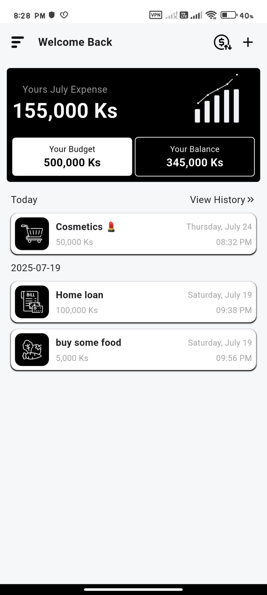
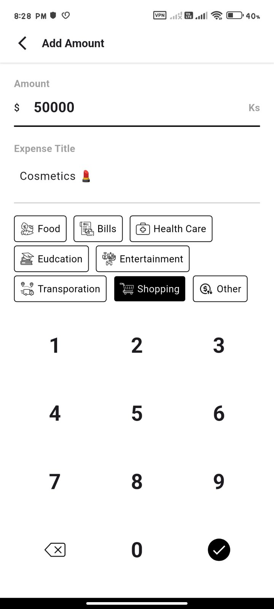
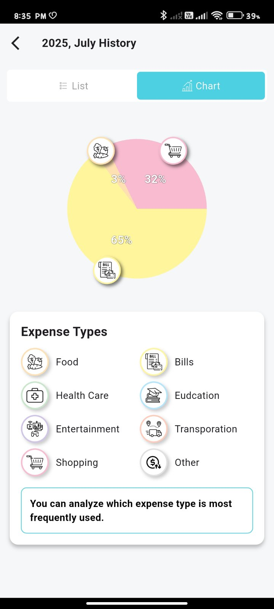

# 💰 Expense Tracker

A simple and elegant Flutter app for tracking your daily expenses. Built using GetX for state management and Isar for local storage to keep your data private and offline-friendly.

---

## 📱 Features

- 📝 Add and delete expenses
- 📊 View total daily and monthly spending
- 🔍 Filter expenses by month 
- 💾 Local storage (offline support)
- ⚡ Built with Flutter and GetX

---

## 🚀 Getting Started

### Prerequisites

- Flutter SDK (v3.x or later recommended)
- Android Studio / VS Code
- Emulator or physical device

